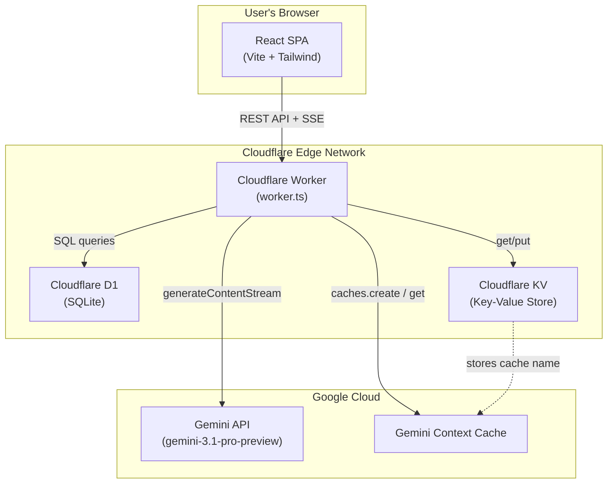

# GTM Auditor — AI-Powered Container Analysis

An intelligent chat interface for auditing Google Tag Manager containers, powered by **Google Gemini** and deployed on **Cloudflare's serverless stack**.

[](https://workers.cloudflare.com/)
[](https://react.dev/)
[](https://ai.google.dev/)
[](https://www.typescriptlang.org/)
[](https://tailwindcss.com/)

[Live Demo →](https://gtm-auditor-5ks.pages.dev/) · [API Endpoint →](https://gtm-auditor-server.iammsk.workers.dev)
---

## 🎯 What is GTM Auditor?

GTM containers can grow to **thousands of lines of JSON** with hundreds of tags, triggers, and variables — making manual audits slow and error-prone. GTM Auditor loads your entire container into an AI model as persistent context, then lets you **ask natural-language questions** and get instant, accurate answers.

### The Problem → Solution

| Problem | Solution |
|---------|----------|
| GTM containers have 100+ tags with thousands of lines of JSON — auditing manually is slow | AI has the full container pre-loaded and can instantly answer about any tag, trigger, or variable |
| Container exports are difficult for non-technical stakeholders | The LLM translates raw JSON into plain-English explanations |
| Auditing requires exporting → reading → cross-referencing trigger IDs → checking consent one by one | Just ask *"Are there any missing consent settings?"* and get a structured answer |

### Example Questions You Can Ask

- *"What tags fire on the page load event?"*
- *"Show me all variables that reference cookies"*
- *"Are there any tags with missing consent settings?"*
- *"Summarize the overall health of this container"*
- *"Which triggers use custom JavaScript conditions?"*

---

## ✨ Features

- 🤖 **AI-Powered Analysis** — Google Gemini 3.1 Pro with full container context
- ⚡ **Real-Time Streaming** — Responses stream via SSE with a live typing indicator
- 🔒 **Secure Invite-Only Access** — Robust authentication system utilizing Web Crypto API for secure password hashing and unique single-use invitation keys.
- 💬 **Persistent Chat History** — Conversations stored in Cloudflare D1 (SQLite), securely scoped to individual user accounts.
- 📂 **Session Management** — Create, rename, delete, and resume chat sessions.
- 🗂️ **Smart Date Grouping** — Sessions organized by Today, Yesterday, This Week, Earlier.
- 📝 **Markdown Rendering** — AI responses rendered as rich Markdown with code blocks, tables, and lists.
- 🧠 **Context Caching** — Gemini context cache avoids re-sending ~771KB of container data on every request.
- 🎨 **"Bright Horizons" Aesthetics** — A clean, light-themed responsive design featuring subtle wave patterns, a white card-based layout, and modern typography.
- 🏷️ **Auto-Titling** — New chats are automatically titled based on the first question.

---

## 🏗️ Architecture

```
User → React SPA → fetch() → Cloudflare Worker → {KV, D1, Gemini} → SSE Stream → React → Rendered Markdown
```



### How a Chat Message Flows

1. User types a question in the React frontend
2. Frontend sends `POST /api/chat` with `{ sessionId, question }` (authenticated via token)
3. Worker fetches the GTM container from **KV** and conversation history from **D1** for the user
4. Worker gets or creates a **Gemini Context Cache** (avoids re-sending the container)
5. Worker calls `generateContentStream()` and pipes chunks as **SSE events**
6. Frontend parses each SSE chunk and appends it to the message in real-time
7. Once streaming completes, the worker **persists both messages to D1**

---

## 🛠️ Tech Stack

### Frontend

| Technology | Version | Purpose |
|------------|---------|---------|
| React | 19.0.0 | UI component library |
| Vite | 6.2.0 | Build tool & dev server |
| TypeScript | 5.8.2 | Type-safe JavaScript |
| Tailwind CSS | 4.1.14 | Utility-first CSS framework |
| react-markdown | 10.1.0 | Markdown rendering for AI responses |
| lucide-react | 0.546.0 | Icon library |
| motion | 12.23.24 | Animation library |

### Backend

| Technology | Purpose |
|------------|---------|
| Cloudflare Workers | Serverless edge compute (runs `worker.ts`) |
| Cloudflare D1 | Serverless SQLite — users, auth, chat sessions & messages |
| Cloudflare KV | Key-Value store — GTM container JSON & Gemini cache |
| @google/genai | 1.29.0 — Google Gemini SDK |
| Wrangler | 4.82.2 — Cloudflare CLI |

---

## 📁 Project Structure

```
gtm-auditor_L/
├── src/                          # Frontend source code
│   ├── App.tsx                   # Root component — session state & routing manager
│   ├── main.tsx                  # React DOM entry point
│   ├── index.css                 # Tailwind CSS entry with "Bright Horizons" theming
│   ├── components/
│   │   ├── Auth/                 # Registration and login components
│   │   ├── Dashboard.tsx         # Chat interface — messages, input, streaming
│   │   └── Sidebar.tsx           # Session list, invite key management, logout
│   ├── services/
│   │   └── chatApi.ts            # API client — HTTP calls + SSE stream parser
│   └── utils/
│       ├── clean-json.ts         # Strips control characters from JSON
│       └── gtm-minifier.ts       # Minifies GTM container JSON (~50% reduction)
├── worker.ts                     # Cloudflare Worker — backend API + Gemini integration
├── schema.sql                    # D1 database schema (auth + sessions + messages)
├── wrangler.toml                 # Cloudflare Worker configuration & bindings
├── vite.config.ts                # Vite build configuration
├── tsconfig.json                 # TypeScript compiler options
├── index.html                    # Vite HTML template
├── package.json                  # Dependencies & scripts
└── get-minified.js               # Standalone GTM container minification script
```

---

## 🚀 Getting Started

### Prerequisites

- [Node.js](https://nodejs.org/) (v18+)
- [pnpm](https://pnpm.io/) or npm
- A [Google Gemini API key](https://ai.google.dev/)
- A [Cloudflare account](https://dash.cloudflare.com/) (for deployment)

### 1. Install Dependencies

```bash
pnpm install
```

### 2. Configure Environment

Create a `.env` file in the project root:

```env
GEMINI_API_KEY="your-gemini-api-key-here"
```

### 3. Run Locally

You need **two terminals** — one for the frontend, one for the backend:

```bash
# Terminal 1 — Frontend (Vite dev server)
pnpm run dev          # → http://localhost:5173

# Terminal 2 — Backend (Cloudflare Worker)
pnpm run dev:worker   # → http://localhost:8787
```

> **Note:** During local development, `chatApi.ts` points to the production Worker URL by default. To test against your local Worker, update the `BASE` constant in `src/services/chatApi.ts` to `http://localhost:8787`.

### Available Scripts

| Script | Command | Purpose |
|--------|---------|---------|
| `dev` | `vite` | Start frontend dev server with HMR |
| `dev:worker` | `wrangler dev` | Start backend Worker locally |
| `build` | `vite build` | Production build → `dist/` |
| `preview` | `vite preview` | Preview production build |
| `lint` | `tsc --noEmit` | TypeScript type-checking |

---

## ☁️ Deployment

### Backend — Cloudflare Workers

```bash
# Deploy the Worker
npx wrangler deploy
```

The Worker is configured via `wrangler.toml`:

```toml
name = "gtm-auditor-server"
main = "worker.ts"
compatibility_date = "2024-01-01"
compatibility_flags = ["nodejs_compat"]

[[kv_namespaces]]
binding = "GTM_CONTAINER"
id = "your-kv-namespace-id"

[[d1_databases]]
binding = "gtm_chat_history"
database_name = "gtm-chat-history"
database_id = "your-d1-database-id"
```

### Frontend — Cloudflare Pages

```bash
# Build & deploy
pnpm run build
npx wrangler pages deploy dist --project-name gtm-auditor
```

### First-Time Setup Checklist

1. Install Wrangler: `npm install -g wrangler`
2. Authenticate: `wrangler login`
3. Create a KV namespace and note the ID
4. Upload GTM container JSON to KV:
   ```bash
   npx wrangler kv:key put --namespace-id=<YOUR_KV_ID> "container" --path=./src/Container/container-minified.json
   ```
5. Create D1 database: `wrangler d1 create gtm-chat-history`
6. Run schema migration:
   ```bash
   npx wrangler d1 execute gtm-chat-history --file=./schema.sql --remote
   ```
7. Set the Gemini API key secret: `wrangler secret put GEMINI_API_KEY`
8. Deploy the Worker: `npx wrangler deploy`
9. Build & deploy the frontend: `pnpm build && npx wrangler pages deploy dist --project-name gtm-auditor`

---

## 📡 API Reference

All endpoints are prefixed with `/api` on the Worker URL.

| Method | Endpoint | Description |
|--------|----------|-------------|
| `POST` | `/api/auth/register` | Register a new user with an invite key |
| `POST` | `/api/auth/login` | Authenticate and obtain a token |
| `POST` | `/api/auth/invite` | Generate a new single-use invite key |
| `GET` | `/api/sessions` | List all chat sessions for the logged-in user |
| `POST` | `/api/sessions` | Create a new session (`{ id, title }`) |
| `PATCH` | `/api/sessions/:id` | Rename a session (`{ title }`) |
| `DELETE` | `/api/sessions/:id` | Delete a session and all its messages |
| `GET` | `/api/sessions/:id/messages` | Get all messages for a session |
| `POST` | `/api/chat` | Send a question, receive SSE stream (`{ sessionId, question }`) |

### SSE Stream Format

The `/api/chat` endpoint returns a `text/event-stream` response:

```
data: {"text":"Based on your container"}

data: {"text":", the following tags are"}

data: {"text":" missing consent settings:\n\n1."}

data: [DONE]
```

---

## 🧠 Gemini Context Caching

The most critical performance optimization — avoids re-sending ~771KB of container data on every request:

| Metric | Without Caching | With Caching |
|--------|----------------|--------------|
| **Input tokens/request** | ~200K+ | ~1K–5K |
| **Latency** | Slower | Faster |
| **API cost** | High | Significantly lower |

**How it works:**
1. On first request, the Worker creates a Gemini context cache containing the full container JSON (TTL: 30 min)
2. The cache name is stored in Cloudflare KV for cross-request reuse
3. Subsequent requests reference the cache instead of re-sending the container
4. If cache creation fails, the Worker falls back to inline context

---

## 🗄️ Database Schema

The D1 database ensures secure user accounts and persistent chat history with the following core structure:

```sql
-- Users
CREATE TABLE users (
  id         TEXT PRIMARY KEY,
  username   TEXT NOT NULL UNIQUE,
  email      TEXT NOT NULL UNIQUE,
  password   TEXT NOT NULL,
  created_at INTEGER NOT NULL,
  updated_at INTEGER NOT NULL DEFAULT 0
) WITHOUT ROWID;

-- Auth Tokens
CREATE TABLE auth_tokens (
  token      TEXT PRIMARY KEY,
  user_id    TEXT NOT NULL REFERENCES users(id) ON DELETE CASCADE,
  created_at INTEGER NOT NULL,
  expires_at INTEGER NOT NULL
) WITHOUT ROWID;

-- Invite Keys (for secure registration)
CREATE TABLE invite_keys (
  invite_key TEXT PRIMARY KEY,
  created_by TEXT NOT NULL REFERENCES users(id) ON DELETE CASCADE,
  used_by    TEXT          REFERENCES users(id) ON DELETE SET NULL,
  used_at    INTEGER,
  created_at INTEGER NOT NULL
) WITHOUT ROWID;

-- Sessions
CREATE TABLE sessions (
  id         TEXT PRIMARY KEY,
  title      TEXT NOT NULL DEFAULT 'New Chat',
  user_id    TEXT NOT NULL REFERENCES users(id) ON DELETE CASCADE,
  created_at INTEGER NOT NULL,
  updated_at INTEGER NOT NULL
) WITHOUT ROWID;

-- Messages
CREATE TABLE messages (
  id         INTEGER PRIMARY KEY AUTOINCREMENT,
  session_id TEXT NOT NULL REFERENCES sessions(id) ON DELETE CASCADE,
  role       TEXT NOT NULL CHECK(role IN ('user', 'model')),
  text       TEXT NOT NULL,
  created_at INTEGER NOT NULL
);
```
*(Indices and further details are omitted for brevity, see `schema.sql` for full schema including fast lookup structures)*

---

## 🔒 Security Notes

> **⚠️ This project is intended for personal/internal use.** The following are known considerations:

| Item | Status | Notes |
|------|--------|-------|
| Authentication | **Implemented** | Secure invite-only access. Web Crypto hashing. |
| CORS | `*` (wildcard) | Restrict to your domain for production |
| Rate Limiting | None | Consider adding for API abuse protection |
| API Key | Stored as Cloudflare secret | Never commit keys to version control |

---

## 📄 License

This project is private and not licensed for redistribution.

---

<div align="center">
<sub>Built with ❤️ using React, Cloudflare Workers, and Google Gemini</sub>
</div>
