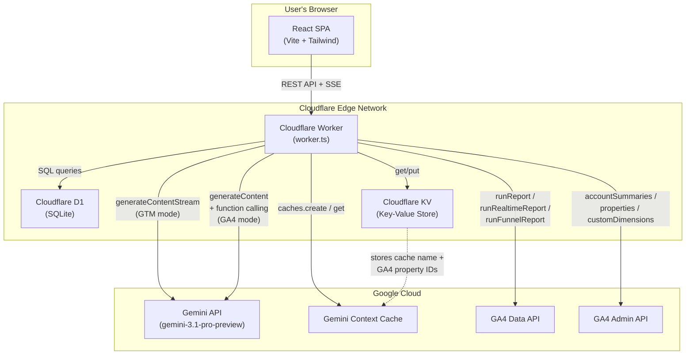

# GTM Auditor — AI-Powered Container & Analytics Analysis

An intelligent dual-mode chat interface for auditing **Google Tag Manager containers** and querying **Google Analytics 4 data**, powered by **Google Gemini** and deployed on **Cloudflare's serverless stack**.

[](https://workers.cloudflare.com/)
[](https://react.dev/)
[](https://ai.google.dev/)
[](https://www.typescriptlang.org/)
[](https://tailwindcss.com/)

[Live Demo →](https://gtm-auditor-5ks.pages.dev/) · [API Endpoint →](https://gtm-auditor-server.iammsk.workers.dev)

---

## What is GTM Auditor?

GTM containers can grow to **thousands of lines of JSON** with hundreds of tags, triggers, and variables — making manual audits slow and error-prone. GA4 properties accumulate complex event configurations, custom dimensions, and campaign data that require deep analytical querying. GTM Auditor addresses both challenges in a single unified interface.

### Two Modes, One Platform

| Mode | How It Works | Powered By |
|------|-------------|------------|
| **GTM Mode** | Loads your entire GTM container JSON into Gemini as persistent context. Ask natural-language questions and get instant, accurate answers about any tag, trigger, or variable. | Gemini context caching + SSE streaming |
| **GA4 Mode** | Connects to your GA4 property via service account. Gemini uses **function calling** to autonomously query the GA4 Data & Admin APIs, then analyzes and explains the results. | Gemini function calling + GA4 REST APIs |

### The Problem → Solution

| Problem | Solution |
|---------|----------|
| GTM containers have 100+ tags with thousands of lines of JSON — auditing manually is slow | AI has the full container pre-loaded and can instantly answer about any tag, trigger, or variable |
| Container exports are difficult for non-technical stakeholders | The LLM translates raw JSON into plain-English explanations |
| Auditing requires exporting → reading → cross-referencing trigger IDs → checking consent one by one | Just ask *"Are there any missing consent settings?"* and get a structured answer |
| GA4 data queries require navigating complex UIs and building API requests manually | Just ask *"What were the top landing pages last month?"* and Gemini fetches the data for you |
| Understanding GA4 funnel performance requires multiple report configurations | Ask *"Show me the checkout funnel drop-off rates"* and get an instant analysis |

### Example Questions You Can Ask

**GTM Mode:**
- *"What tags fire on the page load event?"*
- *"Show me all variables that reference cookies"*
- *"Are there any tags with missing consent settings?"*
- *"Summarize the overall health of this container"*
- *"Which triggers use custom JavaScript conditions?"*

**GA4 Mode:**
- *"What are the top 10 events by count in the last 30 days?"*
- *"Show me active users right now (realtime)"*
- *"What's the bounce rate by device category this month?"*
- *"List all custom dimensions and metrics configured on this property"*
- *"Show me the checkout funnel from page_view → begin_checkout → purchase"*
- *"Which campaigns drove the most conversions last quarter?"*

---

## Features

### Core
- **Dual-Mode Interface** — Seamlessly switch between GTM container analysis and GA4 live data querying with a one-click mode toggle in the header
- **AI-Powered Analysis** — Google Gemini 3.1 Pro with full container context (GTM) or live API function calling (GA4)
- **Real-Time Streaming** — GTM responses stream via SSE with a live typing indicator; GA4 responses use simulated streaming for smooth UX
- **Persistent Chat History** — Conversations stored in Cloudflare D1 (SQLite), securely scoped to individual user accounts and separated by mode
- **Session Management** — Create, rename, delete, and resume chat sessions (separate session lists per mode)
- **Smart Date Grouping** — Sessions organized by Today, Yesterday, This Week, Earlier
- **Markdown Rendering** — AI responses rendered as rich Markdown with code blocks, tables, and lists
- **Auto-Titling** — New chats are automatically titled based on the first question

### GTM-Specific
- **Context Caching** — Gemini context cache avoids re-sending ~771KB of container data on every request (TTL: 30 min)
- **GTM Container Minification** — Reduces raw 1.6MB container JSON to ~353KB (78% reduction) with human-readable variable and trigger resolution
- **SSE Streaming** — True server-sent events for real-time token-by-token response delivery

### GA4-Specific
- **Service Account Authentication** — Secure JWT-based OAuth 2.0 with RS256 signing, fully implemented in the Worker using Web Crypto API (no external auth libraries)
- **Gemini Function Calling** — 7 tool declarations allow Gemini to autonomously fetch GA4 data before answering
- **GA4 Data API Integration** — Run standard reports, realtime reports, and funnel reports
- **GA4 Admin API Integration** — Retrieve account summaries, property details, custom dimensions/metrics, and Google Ads links
- **Per-User Property Configuration** — Each user can configure their own GA4 property ID, stored in Cloudflare KV
- **Access Token Caching** — Service account access tokens are cached in-memory with automatic refresh

### Security & Auth
- **Secure Invite-Only Access** — Robust authentication system utilizing Web Crypto API for secure PBKDF2 password hashing (100K iterations, SHA-256) and unique single-use invitation keys
- **"Bright Horizons" Aesthetics** — A clean, light-themed responsive design featuring a white card-based layout and modern typography

---

## Architecture

```
User → React SPA → fetch() → Cloudflare Worker → {KV, D1, Gemini, GA4 APIs} → SSE/JSON → React → Rendered Markdown
```



### How a GTM Chat Message Flows

1. User types a question in the React frontend (GTM mode)
2. Frontend sends `POST /api/chat` with `{ sessionId, question, mode: "gtm" }` (authenticated via Bearer token)
3. Worker authenticates the user via token lookup in D1
4. Worker fetches the GTM container from **KV** and conversation history from **D1** for the session
5. Worker gets or creates a **Gemini Context Cache** (TTL: 30 min, avoids re-sending the container)
6. Worker calls `generateContentStream()` and pipes chunks as **SSE events**
7. Frontend parses each SSE chunk and appends it to the message in real-time
8. Once streaming completes, the worker **persists both messages to D1** in a batch

### How a GA4 Chat Message Flows

1. User types a question in the React frontend (GA4 mode)
2. Frontend sends `POST /api/chat` with `{ sessionId, question, mode: "ga4", ga4PropertyId }` (authenticated via Bearer token)
3. Worker authenticates the user and resolves the GA4 property ID (from request body or per-user KV)
4. Worker obtains a **service account access token** (JWT → OAuth2 token exchange, cached in-memory)
5. Worker calls `generateContent()` with 7 GA4 function declarations as tools
6. Gemini responds with **function calls** — the Worker executes them against the GA4 APIs
7. Function results are fed back to Gemini, which may issue further function calls (up to 6 tool turns)
8. Once Gemini produces a text response, Worker returns it as JSON
9. Frontend simulates streaming for smooth UX, then **persists both messages to D1**

---

## GA4 Function Calling — Tool Declarations

The Worker registers 7 tools with Gemini for GA4 mode. Gemini autonomously selects which tools to use based on the user's question:

| Tool | Description | API |
|------|-------------|-----|
| `get_account_summaries` | Discover available GA4 accounts and properties | Admin API |
| `get_property_details` | Property name, create time, industry, timezone, currency | Admin API |
| `list_google_ads_links` | Google Ads account links for a property | Admin API |
| `run_report` | Standard analytics report — events, users, sessions, conversions, revenue, etc. | Data API |
| `run_realtime_report` | Realtime data for the last 30 minutes | Data API |
| `run_funnel_report` | Funnel analysis with step-by-step progression | Data API (v1alpha) |
| `get_custom_dimensions_and_metrics` | Custom dimensions and metrics defined on a property | Admin API |

**Multi-turn tool calling:** Gemini can make up to **6 sequential tool calls** per question, enabling complex queries like _"Compare this month's traffic to last month, broken down by source"_ — where Gemini issues multiple `run_report` calls with different date ranges.

---

## Tech Stack

### Frontend

| Technology | Version | Purpose |
|------------|---------|---------|
| React | 19.0.0 | UI component library |
| Vite | 6.2.0 | Build tool & dev server |
| TypeScript | 5.8.2 | Type-safe JavaScript |
| Tailwind CSS | 4.1.14 | Utility-first CSS framework (with `@tailwindcss/typography` plugin) |
| react-markdown | 10.1.0 | Markdown rendering for AI responses |
| lucide-react | 0.546.0 | Icon library |
| motion | 12.23.24 | Animation library (Framer Motion successor) |
| clsx + tailwind-merge | — | Conditional class merging utility |

### Backend

| Technology | Purpose |
|------------|---------|
| Cloudflare Workers | Serverless edge compute (entire backend in a single `worker.ts` file, ~1,078 lines) |
| Cloudflare D1 | Serverless SQLite — users, auth tokens, invite keys, chat sessions & messages |
| Cloudflare KV | Key-Value store — GTM container JSON, Gemini cache name, per-user GA4 property IDs |
| @google/genai | 1.29.0 — Google Gemini SDK for streaming AI completions and function calling |
| GA4 Data API | v1beta — Standard reports, realtime reports, funnel reports |
| GA4 Admin API | v1beta — Account summaries, property details, custom dimensions, Google Ads links |
| Web Crypto API | JWT signing (RS256) for service account authentication — zero external auth dependencies |
| Wrangler | 4.82.2 — Cloudflare CLI for dev and deployment |

---

## Project Structure

```
gtm-auditor_L/
├── src/                          # Frontend source code
│   ├── App.tsx                   # Root component — dual-mode state, session routing, mode switcher
│   ├── main.tsx                  # React DOM entry point
│   ├── index.css                 # Tailwind CSS entry with "Bright Horizons" theming
│   ├── vite-env.d.ts             # Vite type declarations
│   ├── Container/
│   │   ├── GTM-*.json            # Raw GTM container export (1.6MB, 37K lines)
│   │   └── container-minified.json # Minified container (353KB)
│   ├── components/
│   │   ├── AuthPage.tsx          # Login/signup page with tabbed interface
│   │   ├── Dashboard.tsx         # Chat interface — messages, input, streaming (GTM & GA4)
│   │   └── Sidebar.tsx           # Session list, invite key management, mode-filtered views
│   ├── context/
│   │   └── AuthContext.tsx        # React auth context provider
│   ├── services/
│   │   ├── authApi.ts            # Auth HTTP client — login, signup, bootstrap, invite
│   │   └── chatApi.ts            # Chat HTTP client — sessions, messages, SSE stream parser,
│   │                             #   GA4 property config, dual-mode sendMessageStream()
│   └── utils/
│       ├── clean-json.ts         # Strips control characters from JSON
│       └── gtm-minifier.ts       # Minifies GTM container JSON (78% reduction)
├── worker.ts                     # Cloudflare Worker — entire backend API (1,078 lines):
│                                 #   Authentication, session CRUD, GTM chat (SSE streaming),
│                                 #   GA4 chat (function calling), GA4 service account auth,
│                                 #   GA4 REST API helpers, Gemini context cache management
├── schema.sql                    # D1 database schema (users, tokens, invites, sessions, messages)
│                                 #   with mode column, indexes, and email validation
├── wrangler.toml                 # Cloudflare Worker configuration & bindings
├── vite.config.ts                # Vite build configuration
├── tsconfig.json                 # TypeScript compiler options
├── index.html                    # Vite HTML template
├── package.json                  # Dependencies & scripts
├── metadata.json                 # App metadata
├── get-minified.ts               # Standalone GTM container minification script (TypeScript)
├── get-minified.js               # Standalone GTM container minification script (JavaScript)
├── .env                          # Dev environment vars (GEMINI_API_KEY, VITE_WORKER_URL)
├── .env.production               # Production environment vars
└── dist/                         # Built output (CSS + JS bundles)
```

---

## Getting Started

### Prerequisites

- [Node.js](https://nodejs.org/) (v18+)
- [pnpm](https://pnpm.io/) or npm
- A [Google Gemini API key](https://ai.google.dev/)
- A [Cloudflare account](https://dash.cloudflare.com/) (for deployment)
- *(Optional, for GA4 mode)* A [Google Cloud service account](https://cloud.google.com/iam/docs/service-accounts-create) with GA4 read access

### 1. Install Dependencies

```bash
pnpm install
```

### 2. Configure Environment

Create a `.env` file in the project root:

```env
GEMINI_API_KEY="your-gemini-api-key-here"
VITE_WORKER_URL="http://localhost:8787"
```

### 3. Run Locally

You need **two terminals** — one for the frontend, one for the backend:

```bash
# Terminal 1 — Frontend (Vite dev server)
pnpm run dev          # → http://localhost:5173

# Terminal 2 — Backend (Cloudflare Worker)
pnpm run dev:worker   # → http://localhost:8787
```

> **Note:** During local development, the frontend automatically detects the environment and points to your local Worker (`http://localhost:8787`). In production, it defaults to the same origin. You can override this by setting `VITE_WORKER_URL` in your `.env` file.

### Available Scripts

| Script | Command | Purpose |
|--------|---------|---------|
| `dev` | `vite` | Start frontend dev server with HMR |
| `dev:worker` | `wrangler dev` | Start backend Worker locally |
| `build` | `vite build` | Production build → `dist/` |
| `preview` | `vite preview` | Preview production build |
| `get-minified` | `tsx get-minified.ts` | Run GTM container minification |
| `lint` | `tsc --noEmit` | TypeScript type-checking |

---

## Deployment

### Backend — Cloudflare Workers

```bash
# Deploy the Worker
npx wrangler deploy
```

The Worker is configured via `wrangler.toml`:

```toml
name = "gtm-auditor-server"
main = "worker.ts"
compatibility_date = "2024-01-01"
compatibility_flags = ["nodejs_compat"]

[[kv_namespaces]]
binding = "GTM_CONTAINER"
id = "your-kv-namespace-id"

[[d1_databases]]
binding = "gtm_chat_history"
database_name = "gtm-chat-history"
database_id = "your-d1-database-id"
```

### Frontend — Cloudflare Pages

```bash
# Build & deploy
pnpm run build
npx wrangler pages deploy dist --project-name gtm-auditor
```

### First-Time Setup Checklist

1. Install Wrangler: `npm install -g wrangler`
2. Authenticate: `wrangler login`
3. Create a KV namespace and note the ID
4. Upload GTM container JSON to KV:
   ```bash
   npx wrangler kv:key put --namespace-id=<YOUR_KV_ID> "container" --path=./src/Container/container-minified.json
   ```
5. Create D1 database: `wrangler d1 create gtm-chat-history`
6. Run schema migration:
   ```bash
   npx wrangler d1 execute gtm-chat-history --file=./schema.sql --remote
   ```
7. Set the Gemini API key secret: `wrangler secret put GEMINI_API_KEY`
8. *(Optional — for GA4 mode)* Set the GA4 service account JSON secret:
   ```bash
   wrangler secret put GA4_SERVICE_ACCOUNT_JSON
   ```
   Paste the full JSON content of your service account key file when prompted.
9. Deploy the Worker: `npx wrangler deploy`
10. Build & deploy the frontend: `pnpm build && npx wrangler pages deploy dist --project-name gtm-auditor`

### GA4 Mode Setup

To enable GA4 mode, you need a Google Cloud service account with access to your GA4 property:

1. **Create a service account** in the [Google Cloud Console](https://console.cloud.google.com/iam-admin/serviceaccounts)
2. **Grant permissions** — Add the service account email as a viewer in your GA4 property (Admin → Property Access Management)
3. **Download the JSON key** for the service account
4. **Set the secret** on your Worker:
   ```bash
   wrangler secret put GA4_SERVICE_ACCOUNT_JSON
   # Paste the entire JSON key file contents when prompted
   ```
5. **Configure a property ID** — After deploying, each user can set their GA4 property ID in the app (stored per-user in KV)

The service account requires these OAuth scopes (automatically requested):
- `https://www.googleapis.com/auth/analytics.readonly`
- `https://www.googleapis.com/auth/analytics`

---

## API Reference

All endpoints are prefixed with `/api` on the Worker URL.

### Authentication

| Method | Endpoint | Auth Required | Description |
|--------|----------|---------------|-------------|
| `POST` | `/api/auth/bootstrap` | No | Create the first user (no invite key needed) |
| `POST` | `/api/auth/signup` | No | Register a new user with an invite key |
| `POST` | `/api/auth/login` | No | Authenticate with email + password, obtain a token |
| `POST` | `/api/auth/logout` | Yes | Invalidate the current auth token |
| `GET` | `/api/auth/me` | Yes | Get current user info |
| `POST` | `/api/auth/invite` | Yes | Generate a new single-use invite key |
| `GET` | `/api/auth/invite-keys` | Yes | List invite keys created by the current user |

### Chat Sessions

| Method | Endpoint | Auth Required | Description |
|--------|----------|---------------|-------------|
| `GET` | `/api/sessions?mode=gtm\|ga4` | Yes | List all chat sessions for the logged-in user, filtered by mode (default: `gtm`) |
| `POST` | `/api/sessions` | Yes | Create a new session (`{ id, title, mode }`) |
| `PATCH` | `/api/sessions/:id` | Yes | Rename a session (`{ title }`) |
| `DELETE` | `/api/sessions/:id` | Yes | Delete a session and all its messages |
| `GET` | `/api/sessions/:id/messages` | Yes | Get all messages for a session |
| `POST` | `/api/chat` | Yes | Send a question (`{ sessionId, question, mode, ga4PropertyId? }`) — returns SSE stream for GTM or JSON for GA4 |

### GA4 Property Configuration

| Method | Endpoint | Auth Required | Description |
|--------|----------|---------------|-------------|
| `GET` | `/api/ga4/property` | Yes | Get the current user's configured GA4 property ID |
| `PUT` | `/api/ga4/property` | Yes | Set/update the GA4 property ID (`{ property_id }`) — must be numeric |

### SSE Stream Format (GTM Mode)

The `/api/chat` endpoint returns a `text/event-stream` response when `mode` is `gtm`:

```
data: {"text":"Based on your container"}

data: {"text":", the following tags are"}

data: {"text":" missing consent settings:\n\n1."}

data: [DONE]
```

### JSON Response Format (GA4 Mode)

The `/api/chat` endpoint returns a JSON response when `mode` is `ga4`:

```json
{
  "answer": "Based on your GA4 data, the top 5 events by count in the last 30 days are:\n\n1. **page_view** — 45,231 events\n2. **scroll** — 32,107 events\n..."
}
```

---

## Gemini Context Caching (GTM Mode)

The most critical performance optimization — avoids re-sending ~771KB of container data on every request:

| Metric | Without Caching | With Caching |
|--------|----------------|--------------|
| **Input tokens/request** | ~200K+ | ~1K–5K |
| **Latency** | Slower | Faster |
| **API cost** | High | Significantly lower |

**How it works:**
1. On first request, the Worker creates a Gemini context cache containing the full container JSON (TTL: 30 min)
2. The cache name is stored in Cloudflare KV for cross-request reuse
3. Subsequent requests reference the cache instead of re-sending the container
4. If cache creation fails, the Worker falls back to inline context injection

---

## GA4 Service Account Authentication

The Worker implements **full JWT-based OAuth 2.0 service account flow** using only the Web Crypto API — no external authentication libraries:

1. **JWT Construction** — Header (`RS256`) + Claims (`iss`, `scope`, `aud`, `iat`, `exp`) encoded as Base64URL
2. **RS256 Signing** — Private key imported via `crypto.subtle.importKey('pkcs8')`, signed with `RSASSA-PKCS1-v1_5`
3. **Token Exchange** — JWT assertion exchanged for an access token via `https://oauth2.googleapis.com/token`
4. **In-Memory Caching** — Access tokens cached with automatic refresh 2 minutes before expiry

---

## GTM Container Minification

A sophisticated utility (`src/utils/gtm-minifier.ts`, ~320 lines) that transforms raw GTM container exports into AI-friendly format:

- **Strips metadata fields** — Removes `fingerprint`, `monitoringMetadata`, `accountId`, `containerId`
- **Resolves variable references** — Replaces opaque `{{_u:12345}}` tokens with human-readable `{{VariableName}}`
- **Normalizes parameters** — Converts nested parameter structures into flat key-value objects
- **Resolves trigger conditions** — Converts to readable strings like `"page_url contains /checkout"`
- **Resolves trigger IDs** — Maps firing/blocking trigger IDs to their names
- **Resolves custom templates** — Maps `cvt_...` IDs to template names
- **78% size reduction** — Raw 1.6MB container → ~353KB minified

---

## Database Schema

The D1 database ensures secure user accounts and persistent chat history with five tables:

```sql
-- Users
CREATE TABLE users (
  id         TEXT PRIMARY KEY,
  username   TEXT NOT NULL UNIQUE,
  email      TEXT NOT NULL UNIQUE
                  CHECK(email LIKE '%_@_%.__%'),  -- Email format validation
  password   TEXT NOT NULL,  -- PBKDF2 hash (100K iterations, SHA-256)
  created_at INTEGER NOT NULL,
  updated_at INTEGER NOT NULL DEFAULT 0
) WITHOUT ROWID;

-- Auth Tokens (30-day expiry)
CREATE TABLE auth_tokens (
  token      TEXT PRIMARY KEY,
  user_id    TEXT NOT NULL REFERENCES users(id) ON DELETE CASCADE,
  created_at INTEGER NOT NULL,
  expires_at INTEGER NOT NULL
) WITHOUT ROWID;

-- Invite Keys (single-use, INV- prefix)
CREATE TABLE invite_keys (
  invite_key TEXT PRIMARY KEY,
  created_by TEXT NOT NULL REFERENCES users(id) ON DELETE CASCADE,
  used_by    TEXT          REFERENCES users(id) ON DELETE SET NULL,
  used_at    INTEGER,
  created_at INTEGER NOT NULL
) WITHOUT ROWID;

-- Chat Sessions (with mode: 'gtm' | 'ga4')
CREATE TABLE sessions (
  id         TEXT PRIMARY KEY,
  title      TEXT NOT NULL DEFAULT 'New Chat',
  mode       TEXT NOT NULL DEFAULT 'gtm' CHECK(mode IN ('gtm', 'ga4')),
  user_id    TEXT NOT NULL REFERENCES users(id) ON DELETE CASCADE,
  created_at INTEGER NOT NULL,
  updated_at INTEGER NOT NULL
) WITHOUT ROWID;

-- Chat Messages
CREATE TABLE messages (
  id         INTEGER PRIMARY KEY AUTOINCREMENT,
  session_id TEXT NOT NULL REFERENCES sessions(id) ON DELETE CASCADE,
  role       TEXT NOT NULL CHECK(role IN ('user', 'model')),
  text       TEXT NOT NULL,
  created_at INTEGER NOT NULL
);
```

### Indexes

| Index | Table | Columns | Purpose |
|-------|-------|---------|---------|
| `idx_auth_tokens_user` | auth_tokens | `user_id` | Fast token lookup by user |
| `idx_auth_tokens_expires` | auth_tokens | `expires_at` | Efficient expired token cleanup |
| `idx_invite_keys_created_by` | invite_keys | `created_by` | List keys by creator |
| `idx_sessions_user` | sessions | `user_id, updated_at DESC` | User session listing (sorted) |
| `idx_sessions_user_mode` | sessions | `user_id, mode, updated_at DESC` | Mode-filtered session listing |
| `idx_messages_session` | messages | `session_id, created_at` | Ordered message retrieval |

See `schema.sql` for the full schema including maintenance queries.

---

## Security Notes

> **This project is intended for personal/internal use.** The following are known considerations:

| Item | Status | Notes |
|------|--------|-------|
| Authentication | **Implemented** | PBKDF2 password hashing (100K iterations, SHA-256) via Web Crypto API |
| Invite-Only Registration | **Implemented** | First user bootstraps without a key; all subsequent users need a valid single-use invite key |
| Token Expiry | **Implemented** | Auth tokens expire after 30 days |
| Email Validation | **Implemented** | SQL CHECK constraint enforces basic email format |
| GA4 Service Account | **Implemented** | JWT (RS256) signing via Web Crypto — private key stored as Cloudflare secret |
| CORS | `*` (wildcard) | Restrict to your domain for production |
| Rate Limiting | None | Consider adding for API abuse protection |
| API Keys | Stored as Cloudflare secrets | `GEMINI_API_KEY` and `GA4_SERVICE_ACCOUNT_JSON` — never committed to version control |

---

## License

This project is private and not licensed for redistribution.

---

<div align="center">
<sub>Built with React, Cloudflare Workers, Google Gemini, and GA4 APIs</sub>
</div>
